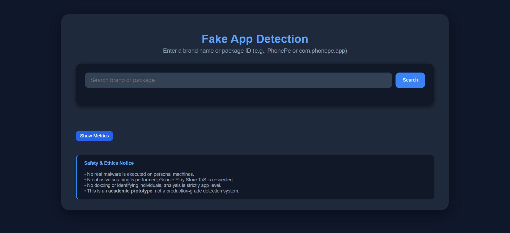
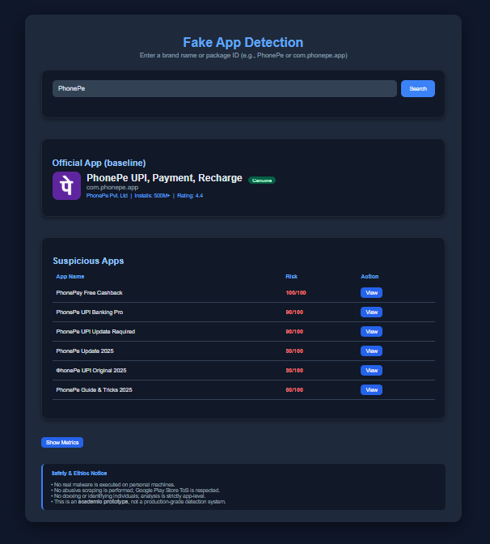
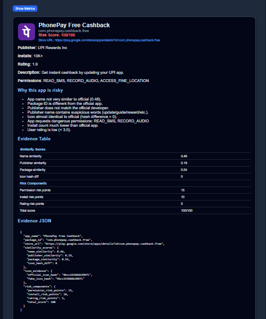
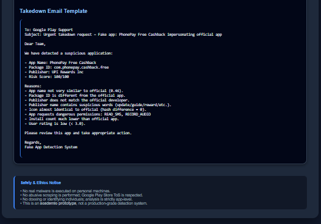

# Fake App Detector — Android + Django Web Application

## Academic Prototype for Fake / Cloned App Detection

## Project Description
Fake App Detector is a lightweight academic prototype designed to detect fake or cloned Android applications. The system compares suspicious apps with genuine baseline apps using similarity analysis, icon hashing, permission audits, and risk scoring to identify potentially harmful or deceptive applications.

## Features

### Fake App Detection Engine
- App name similarity using SequenceMatcher  
- Publisher similarity and mismatch detection  
- Package ID comparison  
- Icon similarity using perceptual hashing (PIL + ImageHash)  
- Permission-based risk analysis  
- Install count and rating-based evaluation  
- Final risk score ranging from **0–100**

### Evidence Panel
- Displays app metadata and overall risk score  
- Evidence table and JSON output  
- Auto-generated takedown email  
- Icon hash comparison  

### Android WebView Application
- Lightweight Android WebView wrapper  
- Mobile-optimized layout  
- Disabled zoom and scrollbars  
- Seamless Django backend integration  

### Detection Metrics
- True Positive (TP), False Positive (FP)  
- False Negative (FN), True Negative (TN)  
- Precision and Recall  
- Displayed in an expandable section  

### Safety & Ethics
- No real malware execution  
- No ToS-violating scraping  
- No doxxing or invasive analysis  
- App-level metadata analysis only  
- Strictly academic and research-oriented  

## How Detection Works
| Check | Description |
|------|------------|
| Name Similarity | Fuzzy match between genuine and suspicious app names |
| Icon Hashing | Perceptual hashing to detect visually similar icons |
| Publisher Match | Identifies mismatched or suspicious publishers |
| Permission Audit | Flags dangerous permissions like READ_SMS, RECORD_AUDIO |
| Installs & Ratings | Low installs and poor ratings increase risk |

## Tech Stack
- **Backend:** Django  
- **Frontend:** HTML, CSS, Vanilla JavaScript  
- **Image Processing:** Pillow, ImageHash  
- **Android:** Kotlin (WebView)  
- **Storage:** Local predefined dataset  

## User Interface Screenshots 

### Detection Results

### Metrics Results

## Future Improvements
- Automatic dataset expansion  
- Machine learning–based icon similarity  
- APK-level scanning APIs  
- Offline mobile risk engine  

## Author
**Kritika Panwar**  
B.E. Computer Science & Engineering  
BMS College of Engineering  

## Note
This project is an academic prototype developed for learning and demonstration purposes and is not production-ready.

